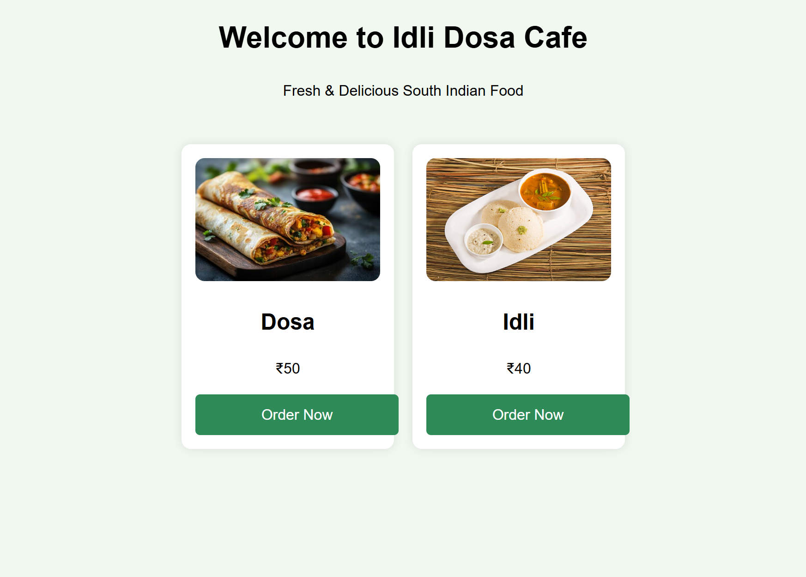
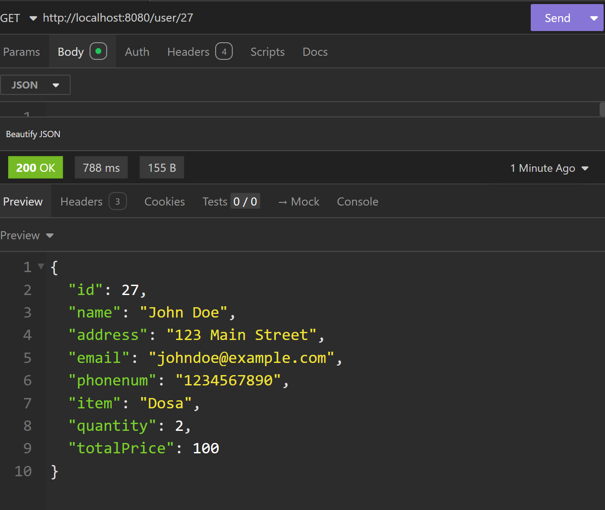

# cafe

**Idli Dosa Cafe Website
A simple Spring Boot web application where customers can place orders for idli and dosa. Admins can also manage customer orders through REST APIs.**

##    Features
- 📄 **Place Orders: Customers can fill out a form with their name, address, email, phone number, item selection (Idli/Dosa), quantity, and total price, and the total price will be automatically calculated.**
- 🛠 **Manage Orders: Admin can create, view, update, and delete user orders using REST APIs (tested via Insomnia/Postman).**
- 📦 **Database Storage: All orders are saved into the database using Hibernate (JPA).**

# Idli Dosa Cafe

**Welcome to the online ordering system!**
 
### 🥞 Order Page

### 🧾 From Page

### 🧾 Bill Page

# Technologies Used

* Java
* Spring Boot
* Spring MVC
* Hibernate (JPA)
* MySQL Database
* JSP
* HTML, CSS, JavaScript
* Insomnia (for API testing)

# **How to Run the Project**

Clone the repository or download the project.

Set up a MySQL database and update the application.properties file with your DB credentials.

Run the project using your IDE (like Eclipse/IntelliJ) or using the terminal.

### **Open your browser and visit:**

`http://localhost:8080/order`

**To test REST APIs:**

Use Insomnia or Postman.

**Base URL:` http://localhost:8080/user`**

## 🧪 How to Test APIs (using Insomnia or Postman)

| API Endpoint     | HTTP Method | Description            |
|------------------|-------------|------------------------|
| `/user`          | POST        | Create a new user       |
| `/user`          | GET         | Get all users           |
| `/user/{id}`     | GET         | Get user by ID          |
| `/user/{id}`     | PUT         | Update user by ID       |
| `/user/{id}`     | DELETE      | Delete user by ID       |

### Get User detail by ID

### Put User details by ID

